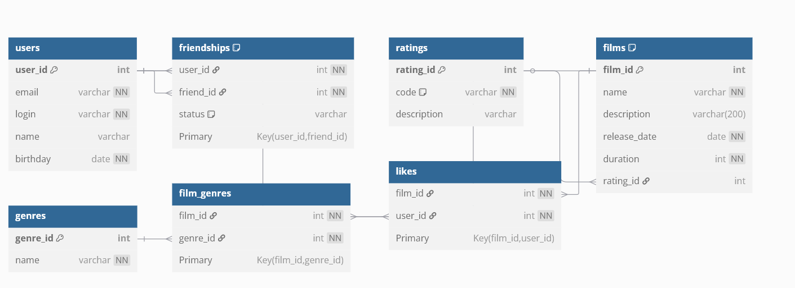

# java-filmorate
Template repository for Filmorate project.

## ER-диаграмма



## Схема базы данных Filmorate

Система построена на нормализованной структуре с поддержкой связей многие-ко-многим и бизнес-логики приложения.

### Таблицы и связи:

- **users** — пользователи.
- **friendships** — связи дружбы с возможностью подтверждения (`pending`, `confirmed`).
- **films** — фильмы с описанием и рейтингом.
- **ratings** — возрастные рейтинги (MPA: G, PG, PG-13, R, NC-17).
- **genres** — жанры фильмов.
- **film_genres** — связи между фильмами и жанрами.
- **likes** — лайки от пользователей к фильмам.

### Примеры SQL-запросов

#### Добавить фильм

```sql
INSERT INTO films (name, description, release_date, duration, rating_id)
VALUES ('Колесо времени', 'по романам', '2024-07-16', 1777, 3);
```

#### Получить 5 самых популярных фильмов
```sql
SELECT f.film_id, f.name, COUNT(l.user_id) AS like_count
FROM films f
LEFT JOIN likes l ON f.film_id = l.film_id
GROUP BY f.film_id
ORDER BY like_count DESC
LIMIT 5;
```
